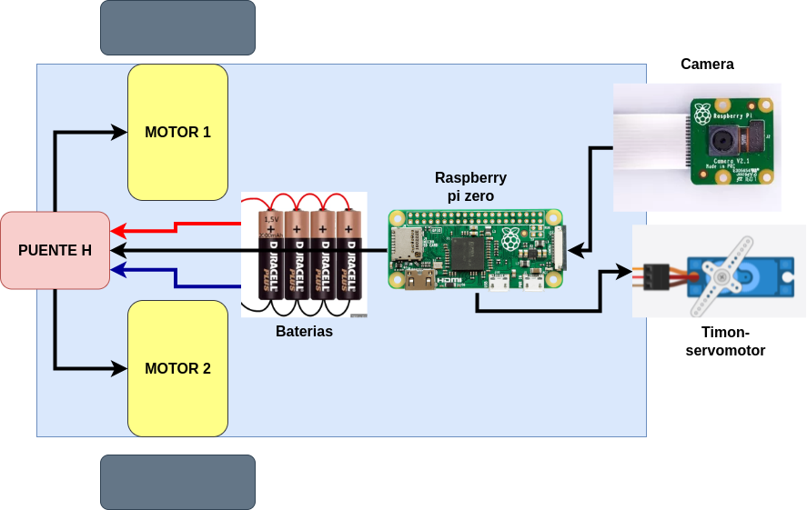

## Construyendo un Seguidor de Línea con Raspberry Pi Zero y Raspi Cam

Por: [Jorge Lambraño - @jelambrar96](https://github.com/jelambrar96)

¡Hola, futuros programadores e inventores! Hoy vamos a aprender cómo construir un divertido seguidor de línea con una **Raspberry Pi Zero** (la más pequeñita de la familia Raspberry), una **Raspi Cam** y un **chasis de Arduino**. Este proyecto es perfecto para que te familiarices con la programación y el mundo de la robótica.

### ¿Qué es un seguidor de línea?

Un seguidor de línea es un robot que sigue un camino marcado por una línea en el suelo, generalmente de color negro sobre un fondo blanco o viceversa. Este tipo de robots se usan en fábricas para transportar cosas por rutas fijas. ¡Pero también son muy divertidos para aprender sobre robótica!

### ¿Qué ventajas se obtienen al construirlo con una raspberry en lugar de un arduino?

Si bien el Arduino es excelente para proyectos sencillos y eficientes en términos de costo y energía, la Raspberry Pi ofrece una plataforma mucho más poderosa y flexible, especialmente cuando necesitas realizar tareas complejas como procesamiento de imágenes, control remoto, y conectividad. Para un seguidor de línea basado en visión por computadora, la Raspberry Pi es la opción más adecuada.

Al construir un seguidor de línea utilizando una Raspberry Pi en lugar de un Arduino, se obtienen varias ventajas, especialmente en términos de procesamiento y funcionalidad. Aquí te explico algunas de las más importantes:

**1. Mayor Capacidad de Procesamiento**
La Raspberry Pi, incluso la Raspberry Pi Zero, es una mini computadora completa con un procesador más potente que el de un Arduino. Esto permite procesar imágenes en tiempo real (como en nuestro proyecto con la **Raspi Cam**), lo que sería mucho más difícil o imposible de hacer con un Arduino debido a su limitada capacidad de procesamiento.

**2. Facilidad para Implementar Visión por Computadora**
Uno de los grandes beneficios de usar una Raspberry Pi es la capacidad de integrar fácilmente visión por computadora. Gracias a la Raspi Cam y bibliotecas como OpenCV, puedes detectar y analizar imágenes, como la línea en el suelo. En un Arduino, esto sería muy complicado, ya que no tiene la capacidad de procesamiento ni el soporte nativo para trabajar con cámaras y procesamiento de imágenes.

**3. Soporte para Lenguajes de Alto Nivel**
La Raspberry Pi te permite programar en lenguajes de alto nivel como Python, que es mucho más fácil de aprender y tiene una gran cantidad de bibliotecas y soporte. Con Arduino, el lenguaje es más bajo nivel (C/C++), lo que puede ser más complicado para principiantes.

### Materiales

- **Raspberry Pi Zero**: Una mini computadora que controlará nuestro robot.
- **Raspi Cam**: La cámara de Raspberry Pi que detectará la línea en el suelo.
- **Chasis de Arduino**: El cuerpo del robot, donde montaremos la Raspberry Pi y los motores.
- **Motores y ruedas**: Para que el robot pueda moverse.
- **Puente H**: Para controlar la velocidad de los motores
- **Servomotor**: Controla la direccion del robot
- **Batería o Power Bank**: Para alimentar tu Raspberry Pi.
- **Cintas adhesivas y tornillos**: Para mantener todo bien fijo.
- **Cinta negra (o blanca)**: Será nuestra "línea" en el suelo que el robot seguirá.

### Diagrama de bloques 

### Paso a Paso

#### 1. Arma el Chasis
Primero, toma el chasis de Arduino y monta los motores y las ruedas. Usa los tornillos y piezas que vienen con el kit para asegurarte de que todo esté bien ajustado. Luego, coloca la Raspberry Pi Zero encima del chasis y fíjala bien con cinta adhesiva o tornillos.

#### 2. Conecta la Raspi Cam
Ahora, conecta la Raspi Cam a la Raspberry Pi Zero. Esto lo hacemos conectando el cable de la cámara al puerto específico en la Raspberry Pi. Asegúrate de que esté bien conectado, ya que la cámara será el "ojo" de nuestro robot.

#### 3. Instala el Sistema Operativo
Antes de continuar, necesitamos instalar el sistema operativo en la Raspberry Pi. Usa una tarjeta microSD con **Raspberry Pi OS** (puedes descargarlo desde el sitio web oficial de Raspberry Pi). Inserta la tarjeta microSD en la Raspberry Pi Zero.

#### 4. Programa el Seguidor de Línea
Aquí viene la parte divertida: ¡la programación! El robot usará la cámara para detectar la línea en el suelo. Para esto, vamos a escribir un programa en Python. El código analizará las imágenes que toma la cámara y calculará si la línea está en el centro, izquierda o derecha. Dependiendo de la posición de la línea, el robot girará o avanzará.

En la capeta `src` hay un codigo ejemplo de como ejecutar. 

#### 5. ¡Prueba tu robot!
Coloca tu robot en el suelo sobre la cinta negra (o blanca) que hayas puesto en el piso. Enciende la Raspberry Pi y observa cómo el robot sigue la línea automáticamente. Si no lo hace bien al principio, no te preocupes, ajustar los parámetros del código es parte del aprendizaje.

### ¿Qué aprenderás con este proyecto?

- **Programación en Python**: Aprenderás a escribir código para controlar un robot.
- **Vision por computadora**: Usarás la cámara para detectar la línea, lo que te introducirá al emocionante mundo de la visión por computadora.
- **Robótica básica**: Verás cómo los motores y la cámara pueden trabajar juntos para hacer que el robot se mueva de manera inteligente.

### ¡A divertirse!

Este proyecto es una excelente manera de aprender y divertirse con la tecnología. Puedes personalizar tu robot con diferentes funciones, como cambiar la velocidad, agregar luces LED o incluso hacer que el robot siga diferentes formas de líneas.

¡Recuerda, la programación es como un superpoder! Con tu imaginación y tus habilidades, ¡puedes crear todo tipo de cosas geniales!

____

Made with Love ❤️ by [@jelambrar96](https://github.com/jelambrar96)
